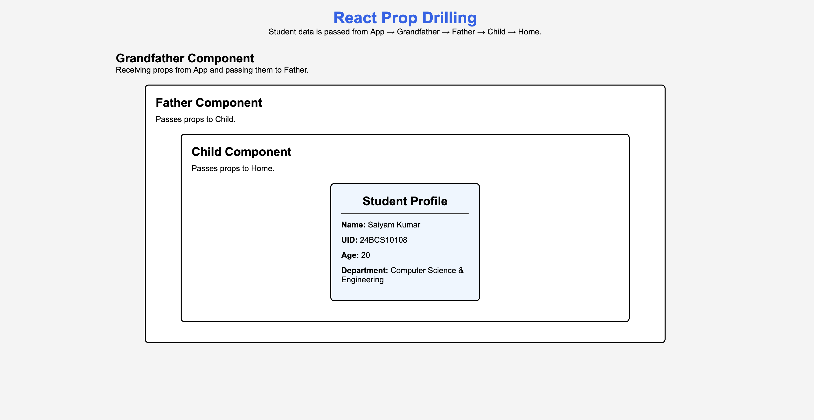

# React Prop Drilling and Student Profile Card

A beginner-friendly React project demonstrating **Prop Drilling** by passing student data through multiple components.

---

## 📚 About the Project

This project explains the concept of **Prop Drilling** in React.

Student information is created inside the **App** component and passed through multiple intermediate components until it reaches the final **Home** component, where it is displayed as a Student Profile Card.

---

## 🚀 Features

- React Functional Components
- Props
- Prop Drilling
- Component Hierarchy
- Student Profile Card
- Simple and Beginner-Friendly UI

---

## 🛠 Tech Stack

- React.js
- Vite
- JSX
- CSS

---

## 📂 Component Flow

```
App
 │
 ▼
Grandfather
 │
 ▼
Father
 │
 ▼
Child
 │
 ▼
Home (Student Profile)
```

---

## 📁 Project Structure

```
src
│
├── components
│   ├── Grandfather.jsx
│   ├── Father.jsx
│   ├── Child.jsx
│   ├── Home.jsx
│   └── Home.css
│
├── App.jsx
├── index.css
└── main.jsx
```

---

## 📸 Project Preview



---

## 💡 What I Learned

- Creating React Functional Components
- Passing data using Props
- Understanding Prop Drilling
- Component Reusability
- Basic React Project Structure

---

## ▶️ Run the Project

Clone the repository

```bash
git clone <repository-link>
```

Go to the project folder

```bash
cd 01_Props_Drilling
```

Install dependencies

```bash
npm install
```

Start the development server

```bash
npm run dev
```

---

## 👨‍💻 Author

**Saiyam Kumar**

Learning React.js 🚀
