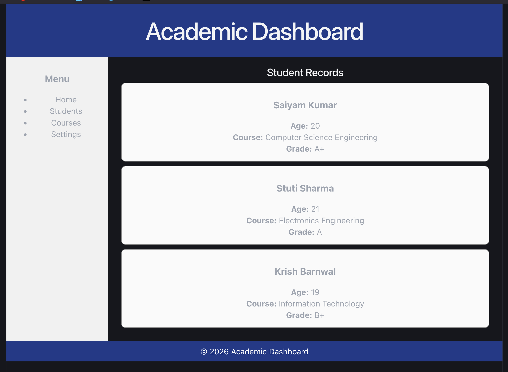

# 🎓 Academic Dashboard

A beginner-friendly React project that demonstrates **component-based architecture** by building a simple Academic Dashboard using reusable React components.

---

## 📚 About the Project

This project is a simple Academic Dashboard developed using React.

It displays a list of students along with their academic details using reusable components such as Header, Sidebar, Student List, Student Card, and Footer.

The project focuses on understanding component composition and passing data through props.

---

## 🚀 Features

- Reusable React Components
- Student Dashboard Layout
- Student Records Display
- Sidebar Navigation
- Header and Footer
- Props for Data Passing
- Conditional Rendering
- Beginner-Friendly UI

---

## 🛠 Tech Stack

- React.js
- Vite
- JSX
- CSS (Inline Styling)

---

## 📂 Component Structure

```
App
│
├── Header
├── Sidebar
├── StudentList
│     └── StudentCard
└── Footer
```

---

## 📁 Project Structure

```
src
│
├── components
│   ├── Header.jsx
│   ├── Sidebar.jsx
│   ├── StudentList.jsx
│   ├── StudentCard.jsx
│   └── Footer.jsx
│
├── App.jsx
├── main.jsx
└── index.css
```

---

## 📸 Project Preview



---

## 💡 React Concepts Used

- Functional Components
- Component Composition
- Props
- Conditional Rendering
- Rendering Lists using `map()`
- Reusable Components

---

## ▶️ Run the Project

Clone the repository

```bash
git clone <repository-link>
```

Go to the project directory

```bash
cd Academic-Dashboard
```

Install dependencies

```bash
npm install
```

Start the development server

```bash
npm run dev
```

---

## 🎯 Learning Outcome

By building this project, I learned:

- Creating reusable React components
- Passing data using Props
- Rendering dynamic lists using `map()`
- Organizing components in a React application
- Building a simple dashboard layout

---

## 👨‍💻 Author

**Saiyam Kumar**

Learning React.js 🚀
