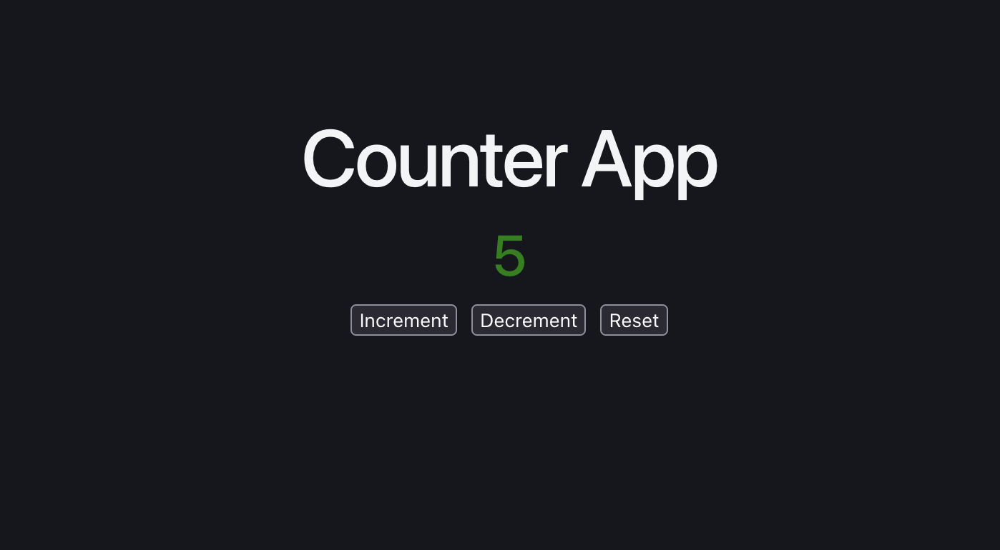
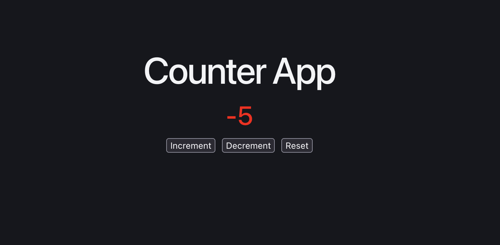
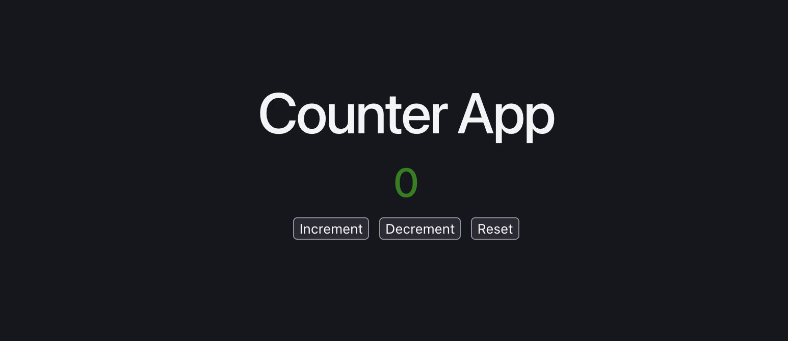

# 🔢 React Counter App

A beginner-friendly React project demonstrating the **useState Hook** by building a simple Counter Application.

---

## 📚 About the Project

This project demonstrates how the **useState Hook** works in React.

Users can increment, decrement, and reset the counter using buttons. The counter value updates dynamically without reloading the page.

Additionally, the counter changes color based on its value:

- 🟢 Green for zero and positive numbers
- 🔴 Red for negative numbers

---

## 🚀 Features

- React useState Hook
- Increment Counter
- Decrement Counter
- Reset Counter
- Dynamic UI Updates
- Conditional Rendering using Ternary Operator
- Beginner-Friendly Interface

---

## 🛠 Tech Stack

- React.js
- Vite
- JSX
- Inline CSS

---

## 📂 Project Structure

```
src
│
├── App.jsx
├── main.jsx
└── index.css
```

---

## 📸 Project Preview

### Increment



---

### Decrement



---

### Reset



---

## 💡 React Concepts Used

- Functional Components
- useState Hook
- Event Handling
- State Management
- Conditional Styling
- JSX

---

## ⚙️ How It Works

- **Increment** increases the counter by **1**.
- **Decrement** decreases the counter by **1**.
- **Reset** sets the counter back to **0**.
- Counter color changes dynamically:
  - Green → Positive or Zero
  - Red → Negative

---

## ▶️ Run the Project

Clone the repository

```bash
git clone <repository-link>
```

Go to the project directory

```bash
cd Counter-App
```

Install dependencies

```bash
npm install
```

Start the development server

```bash
npm run dev
```

---

## 🎯 Learning Outcome

By building this project, I learned:

- React useState Hook
- Managing State
- Updating UI Dynamically
- Handling Button Click Events
- Conditional Rendering
- React Component Basics

---

## 👨‍💻 Author

**Saiyam Kumar**

Learning React.js 🚀
