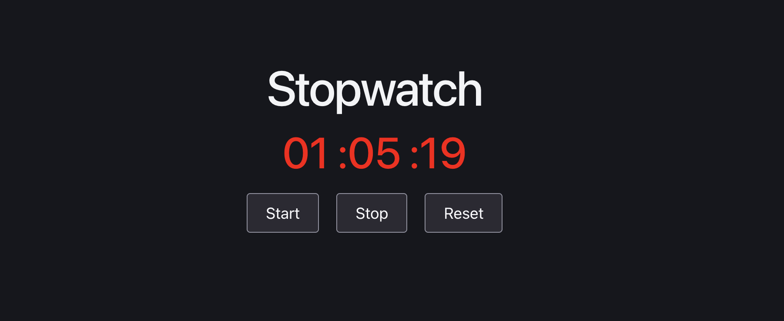

# ⏱️ React Stopwatch App

A beginner-friendly React project demonstrating the **useState** and **useEffect** Hooks by building a simple Stopwatch application.

---

## 📚 About the Project

This project demonstrates how React's **useState** and **useEffect** Hooks work together to build a real-time stopwatch.

The application allows users to:

- ▶️ Start the stopwatch
- ⏸️ Stop the stopwatch
- 🔄 Reset the stopwatch

The stopwatch displays **minutes, seconds, and milliseconds**, updating the UI in real time using React state.

---

## 🚀 Features

- React Functional Components
- useState Hook
- useEffect Hook
- Start Timer
- Stop Timer
- Reset Timer
- Real-Time UI Updates
- Time Formatting (MM : SS : MS)
- Beginner-Friendly Interface

---

## 🛠 Tech Stack

- React.js
- Vite
- JSX
- CSS

---

## 📂 Component Structure

```
App
│
└── Stopwatch
```

---

## 📁 Project Structure

```
src
│
├── components
│   ├── Stopwatch.jsx
│   └── Stopwatch.css
│
├── App.jsx
├── main.jsx
└── index.css
```

---

## 📸 Project Preview



---

## 💡 React Concepts Used

- Functional Components
- useState Hook
- useEffect Hook
- State Management
- Event Handling
- setInterval()
- clearInterval()
- Conditional Rendering
- Time Formatting

---

## ⚙️ How It Works

- Clicking **Start** begins the stopwatch.
- Clicking **Stop** pauses the timer.
- Clicking **Reset** stops the timer and resets it to **00:00:00**.
- The timer updates automatically every few milliseconds using **setInterval()**.
- The **useEffect** Hook starts and clears the interval based on the timer state.

---

## ▶️ Run the Project

Clone the repository

```bash
git clone <repository-link>
```

Navigate to the project directory

```bash
cd Stopwatch-App
```

Install dependencies

```bash
npm install
```

Start the development server

```bash
npm run dev
```

---

## 🎯 Learning Outcome

By building this project, I learned:

- Creating React Functional Components
- Using the useState Hook
- Using the useEffect Hook
- Managing Component State
- Running Side Effects
- Using setInterval() and clearInterval()
- Formatting Time
- Building a Real-Time Stopwatch

---

## 👨‍💻 Author

**Saiyam Kumar**

Learning React.js 🚀
