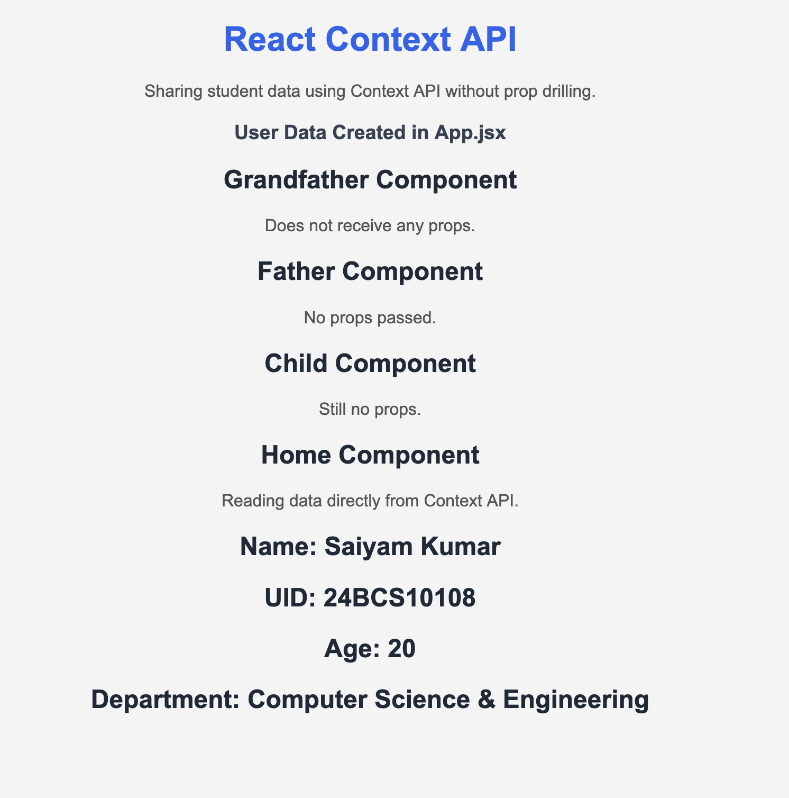

# 🌐 React Context API 

A beginner-friendly React project demonstrating how to use the **Context API** to share data between components without prop drilling.

---

## 📚 About the Project

This project demonstrates how the **React Context API** works by sharing student information from the **App** component directly to the **Home** component.

Unlike Prop Drilling, the data is **not passed through intermediate components as props**. Instead, the **Context Provider** makes the data available to any component that needs it.

---

## 🚀 Features

- React Functional Components
- Context API
- useContext Hook
- Context Provider
- Shared Student Data
- No Prop Drilling
- Student Profile Card
- Beginner-Friendly UI

---

## 🛠 Tech Stack

- React.js
- Vite
- JSX
- CSS

---

## 📂 Component Flow

```
App
│
├── UserContext.Provider
│
└── Grandfather
      │
      ▼
    Father
      │
      ▼
     Child
      │
      ▼
     Home
      │
      ▼
Reads data using useContext()
```

---

## 📁 Project Structure

```
src
│
├── components
│   ├── UserContext.jsx
│   ├── Grandfather.jsx
│   ├── Father.jsx
│   ├── Child.jsx
│   ├── Home.jsx
│   └── Context.css
│
├── App.jsx
├── main.jsx
└── index.css
```

---

## 📸 Project Preview



---

## 💡 React Concepts Used

- Functional Components
- Context API
- Context Provider
- useContext Hook
- Global Data Sharing
- Component Hierarchy
- State Sharing without Props

---

## 🔄 Context API Flow

```
Student Data Created in App.jsx
               │
               ▼
      UserContext.Provider
               │
               ▼
Grandfather → Father → Child → Home
                               │
                               ▼
                    useContext(UserContext)
```

---

## 🆚 Prop Drilling vs Context API

| Prop Drilling | Context API |
|--------------|-------------|
| Pass props through every component | Share data directly using Context |
| Intermediate components forward props | Intermediate components don't need props |
| More repetitive code | Cleaner and easier to maintain |
| Suitable for small applications | Better for shared application data |

---

## ▶️ Run the Project

Clone the repository

```bash
git clone <repository-link>
```

Navigate to the project folder

```bash
cd Context-API-Demo
```

Install dependencies

```bash
npm install
```

Start the development server

```bash
npm run dev
```

---

## 🎯 Learning Outcome

By building this project, I learned:

- Creating and using React Context
- Wrapping components with Context Provider
- Accessing shared data using useContext()
- Avoiding Prop Drilling
- Organizing React Components
- Building reusable React applications

---

## 👨‍💻 Author

**Saiyam Kumar**

Learning React.js 🚀
