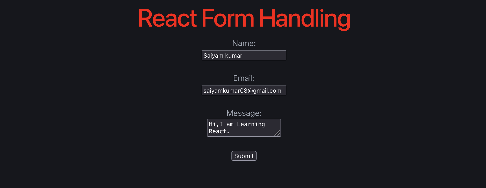

# 📝 React Form Handling

A simple React application built with **React** and **Vite** that demonstrates **form handling using the `useState` hook**. This project captures user input for **Name**, **Email**, and **Message**, and logs the submitted data to the browser console.

## 🚀 Features

- Controlled components using `useState`
- Handles multiple form fields
- Form submission using `onSubmit`
- Prevents page refresh with `preventDefault()`
- Logs submitted form data to the browser console
- Beginner-friendly React project

## 🛠️ Tech Stack

- React
- Vite
- JavaScript (ES6)
- HTML5
- CSS3

## 📂 Project Structure

```text
react-form-handling/
│
├── src/
│   ├── components/
│   │   └── FormHandling.jsx
│   ├── App.jsx
│   ├── main.jsx
│   └── index.css
│
├── package.json
├── vite.config.js
└── README.md
```

## ▶️ Getting Started

### 1. Clone the repository

```bash
git clone <repository-url>
```

### 2. Navigate to the project directory

```bash
cd react-form-handling
```

### 3. Install dependencies

```bash
npm install
```

### 4. Start the development server

```bash
npm run dev
```

Open the local URL shown in the terminal (usually `http://localhost:5173`).

## 📸 Screenshot



## 📚 Concepts Covered

- React Components
- JSX
- `useState` Hook
- Controlled Components
- Form Handling
- Event Handling
- `onChange`
- `onSubmit`
- `preventDefault()`

## 🎯 Learning Outcome

Through this project, I learned how to:

- Manage form inputs using React state
- Handle user input with controlled components
- Submit forms without refreshing the page
- Capture and process form data efficiently

## 👨‍💻 Author

**Saiyam Kumar**

If you like this project, don't forget to ⭐ the repository!
